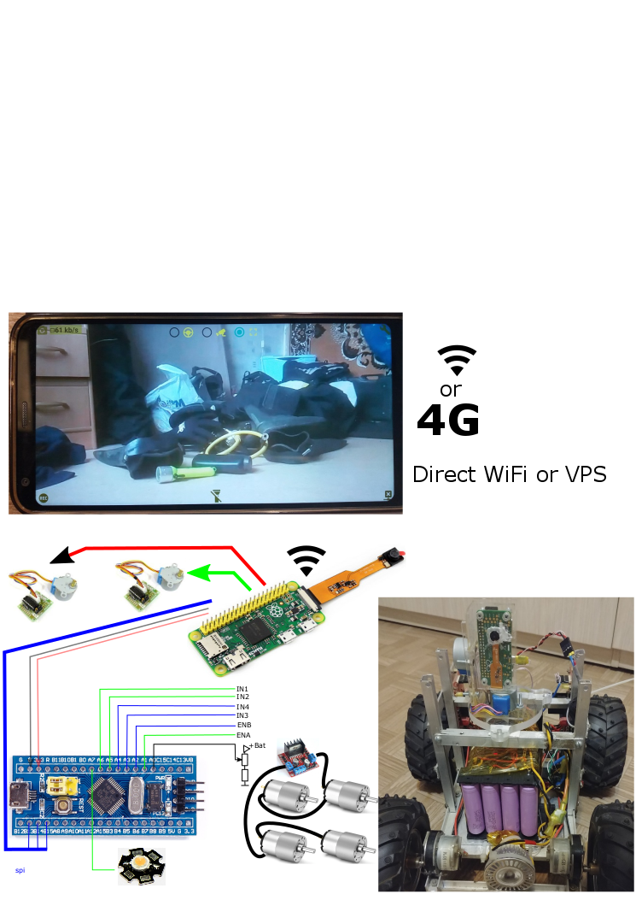
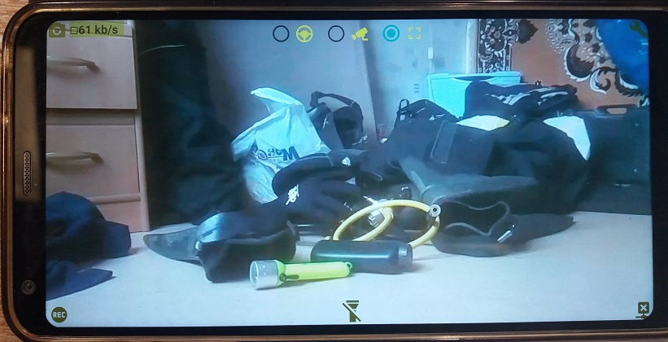
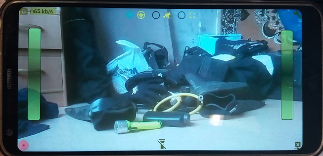
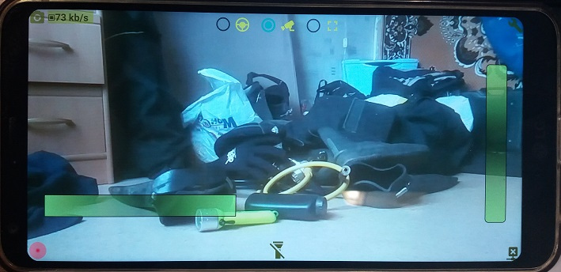
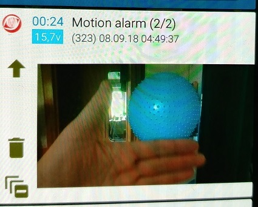
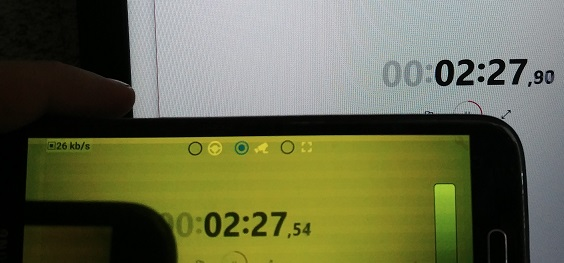
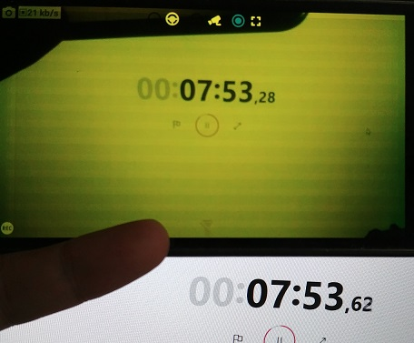

# Raspberry pi FPV (H.264 stream) & motion detector (h.264 motion vectors).
Time of battery life about 100 hours 
Condition: full charged 4S 16x18650 (about 2000Ah per one) and 5-7 min of drive per day.

# hardware (video module) list:
* Raspberry pi zero
* USB WiFi Dongle
* Raspberry pi camera v1.3
* 2x stepper motors 28BYJ-48 + ULN2003 driver

# hardware (carriage) list:
* 4S 16x18650 Li-ion  + 4S 30A Li-ion 18650 (BMS) board
* dc-dc step down converter (out:5v).
* stm32f103c8t6 board
* 4x gear motors + L298N board
* 12v LED lamp (as headlamp)

# software list:
* Android application (tested on the old Samsung S5 Lollipop and the last LG6 Oreo)
* Raspberry pi python host (picamera + spidev + RPi.GPIO)
* stm32f103 software

Android application features list:
* FPV mode:
** Video (H.264) stream player.
** Stepper motors control. Camera horizontal & vertical rotations.
** Carriage motors control. Left and right motor power (PWM) and rotation direction.
** Video record (H.264)
** Snapshot from video stream (jpg files)
* Motion detect mode (Foreground android service)
** Polling raspberry pi server (configured)
** Download motion snapshots (configured)
** Show motion events as android notifications.
* configuration mode
** Video (size, bitrate, ...)
** Network (local network or VPS proxy, port, url, ...)
** Motion detector  (sensitiveness parameters, snapshots content, ...)
** External hardware (stm32f103c8t6 board SPI)

## FPV mode screenshot

## FPV mode & carriage motors control screenshot (+video record on)

## FPV mode & stepper motors control sreenshot

## Motion alarm notification screenshot

# Video streaming lag

For local WiFi network: 350..600ms
Android wifi access point mode. Sample in the very RF noisy environment. About 20..25 networks in phone WiFi list.

For 4G network via VPS server (Raspberry pi python host ssh port forwarding): 300ms..3sec (unpredictable time lag).
Best stable result:

